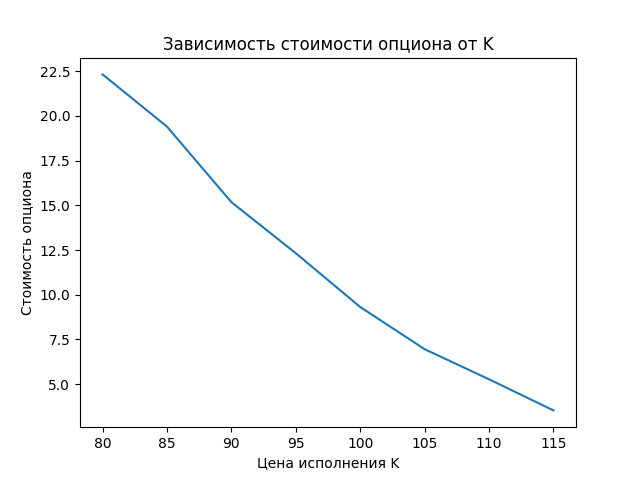
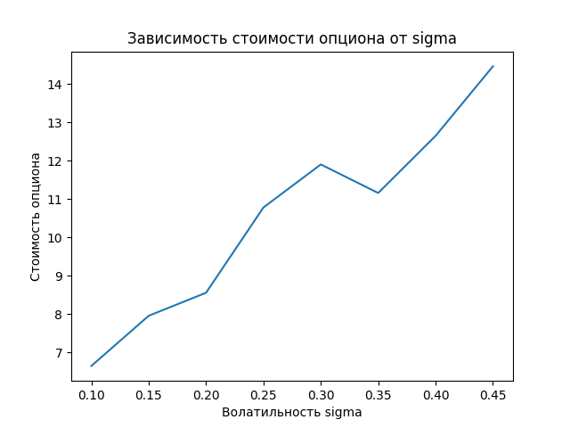
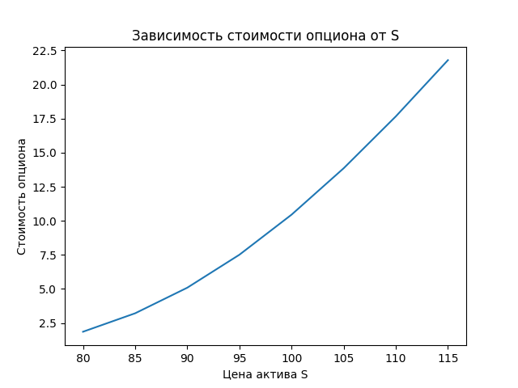

<h2 align="center">МИНИСТЕРСТВО ОБРАЗОВАНИЯ И НАУКИ РЕСПУБЛИКИ КАЗАХСТАН</h2>

<h3 align="center">Некоммерческое акционерное общество «Кокшетауский университет имени Ш. Уалиханова»</h3>

<h4 align="center">Студент Владислав Зенкевич (ИР-222)</h4>
<h4 align="center">Факультет педагогики</h4>
<h4 align="center">Кафедра математики, физики, информатики</h4>


# Метод Монте-Карло и метод интегралов в финансовом моделировании. Оценка стоимости опционов

## Аннотация

В статье рассматриваются метод Монте-Карло и метод интегралов для финансового моделирования и оценки стоимости опционов. Приводятся теоретические основы методов, а также примеры их практического применения в финансовой сфере. Реализована имитационная модель Монте-Карло для оценки европейского опциона колл. Построены графики зависимости стоимости опциона от цены исполнения и волатильности актива.

**Ключевые слова:** метод Монте-Карло, финансовое моделирование, оценка опционов, численные методы.

## Введение

В современных условиях все большее значение приобретают методы финансового моделирования, позволяющие прогнозировать поведение финансовых инструментов. Одним из наиболее распространенных подходов является имитационное моделирование методом Монте-Карло. Другим популярным методом оценки производных финансовых инструментов, в частности опционов, является метод интегралов.

## Основная часть

Метод Монте-Карло основан на многократном моделировании случайных величин и анализе результатов моделирования. Суть метода заключается в построении выборки случайных сценариев изменения переменных модели и расчете характеристик распределения искомых показателей по этой выборке.

Рассмотрим применение метода Монте-Карло для оценки стоимости европейского опциона колл. Его стоимость $C$ можно рассчитать по формуле:

$$
C = e^{-rT} \mathbb{E}\left[\max(0, S_T - K)\right]
$$

где $S_T$ - стоимость базового актива на момент экспирации опциона;  
$K$ - цена исполнения опциона; 
$r$ - безрисковая процентная ставка;
$T$ - время до экспирации опциона.

Для моделирования используем стохастическое дифференциальное уравнение:

$$
dS = \mu S dt + \sigma S dW,  
$$

где $\mu$ - средняя доходность актива, $\sigma$ - волатильность, $W$ - винеровский процесс.

Моделирование выполняется в несколько этапов:

1. Задаются исходные параметры: $S_0$, $\mu$, $\sigma$, $r$, $T$, $K$.

2. Генерируется случайная величина для моделирования прироста актива на каждом шаге:

    $$\Delta W \sim N(0, \Delta t)$$
    
3. Рассчитывается стоимость актива на каждом шаге по формуле:

    $$S_t = S_{t-1}\exp\left((\mu - 0.5\sigma^2)\Delta t + \sigma\Delta W\right)$$
    
4. Рассчитывается значение опциона по формуле:

    $$C_t = \max(0, S_T - K)$$

5. Расчет повторяется $N$ раз.

6. Оценка стоимости опциона:

    $$C = e^{-rT}\frac{1}{N}\sum_{i=1}^{N} C_t$$

Ниже приведен пример кода на Python для реализации модели:

```python
import numpy as np
from math import exp, sqrt
import matplotlib.pyplot as plt

S0 = 100 # Начальная цена актива
r = 0.05 # Безрисковая ставка  
sigma = 0.2 # Волатильность
T = 1 # Срок до экспирации (в годах) 
K = 100 # Цена исполнения
N = 2000 # Количество итераций
dt = T / N # Шаг по времени

def monte_carlo_call_price(S0, r, sigma, T, K, N, dt):
    call_prices = []
    for i in range(N):
        S = S0
        for t in range(N):
            dZ = np.random.normal(0, sqrt(dt))
            dS = S * (r - 0.5 * sigma**2) * dt + S * sigma * dZ 
            S += dS
        call_prices.append(max(S - K, 0))
    C = exp(-r * T) * np.mean(call_prices)
    return C

C = monte_carlo_call_price(S0, r, sigma, T, K, N, dt)
print("Стоимость опциона:", C)

# График зависимости от K
K_values = np.arange(80, 120, 5)
C_values = [monte_carlo_call_price(S0, r, sigma, T, k, N, dt) for k in K_values]

plt.plot(K_values, C_values)
plt.xlabel('Цена исполнения K')
plt.ylabel('Стоимость опциона')  
plt.title('Зависимость стоимости опциона от K')
plt.show()

# График зависимости от sigma
sigma_values = np.arange(0.1, 0.5, 0.05) 
C_values = [monte_carlo_call_price(S0, r, s, T, K, N, dt) for s in sigma_values]

plt.plot(sigma_values, C_values)
plt.xlabel('Волатильность sigma')
plt.ylabel('Стоимость опциона')
plt.title('Зависимость стоимости опциона от sigma') 
plt.show()
```





Метод интегралов позволяет найти аналитическое решение для оценки стоимости европейских опционов. Для опциона колл формула имеет вид:

$$
C = S N(d_1) - Ke^{-rT} N(d_2),
$$

где

$$
d_1 = \frac{\ln\left(\frac{S}{K}\right) + \left(r + \frac{1}{2}\sigma^2\right)T}{\sigma\sqrt{T}}
$$

$$
d_2 = d_1 - \sigma\sqrt{T} 
$$

$N(x)$ - функция стандартного нормального распределения.

Ниже приведен пример реализации метода интегралов на Python:

```python
from scipy.stats import norm
import numpy as np
import matplotlib.pyplot as plt

S = 100 # Текущая цена актива
K = 100 # Цена исполнения
r = 0.05 # Безрисковая ставка
sigma = 0.2 # Волатильность
T = 1 # Время до исполнения

d1 = (np.log(S/K) + (r + 0.5 * sigma**2) * T) / (sigma * np.sqrt(T))
d2 = d1 - sigma * np.sqrt(T)

call = S * norm.cdf(d1) - K * np.exp(-r * T) * norm.cdf(d2)

print("Стоимость опциона:", call)

# График зависимости от S
S_values = np.arange(80, 120, 5)
call_values = []
for S in S_values:
    d1 = (np.log(S/K) + (r + 0.5 * sigma**2) * T) / (sigma * np.sqrt(T)) 
    d2 = d1 - sigma * np.sqrt(T)
    call = S * norm.cdf(d1) - K * np.exp(-r * T) * norm.cdf(d2)
    call_values.append(call)

plt.plot(S_values, call_values)
plt.xlabel('Цена актива S')
plt.ylabel('Стоимость опциона')
plt.title('Зависимость стоимости опциона от S')
plt.show()
```



Достоинством этого подхода является точная оценка в рамках принятой модели ценообразования. Недостатком является сложность применения для более сложных производных инструментов.

## Заключение

Метод Монте-Карло является универсальным и простым в реализации подходом для оценки финансовых инструментов, однако требует значительных вычислительных ресурсов. Метод интегралов дает точное аналитическое решение для европейских опционов, но не применим для более сложных производных. Комбинирование двух методов позволяет получить эффективное и точное финансовое моделирование.

## Список литературы

1. Ширяев А.Н. Основы стохастической финансовой математики. Т. 2. М.: ФАЗИС, 1998.
2. Hull J.C. Options, Futures and Other Derivatives. Prentice Hall, 2018.
3. Виленский П.Л., Лившиц В.Н., Смоляк С.А. Оценка эффективности инвестиционных проектов. Теория и практика. М.: Дело, 2008.